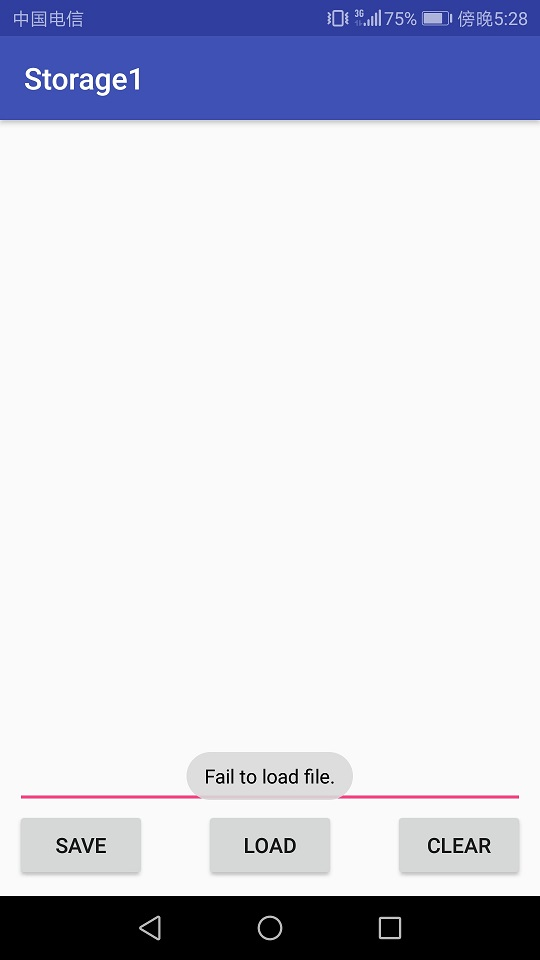
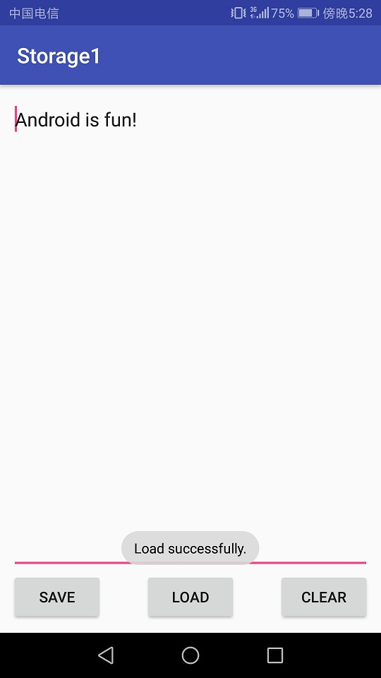
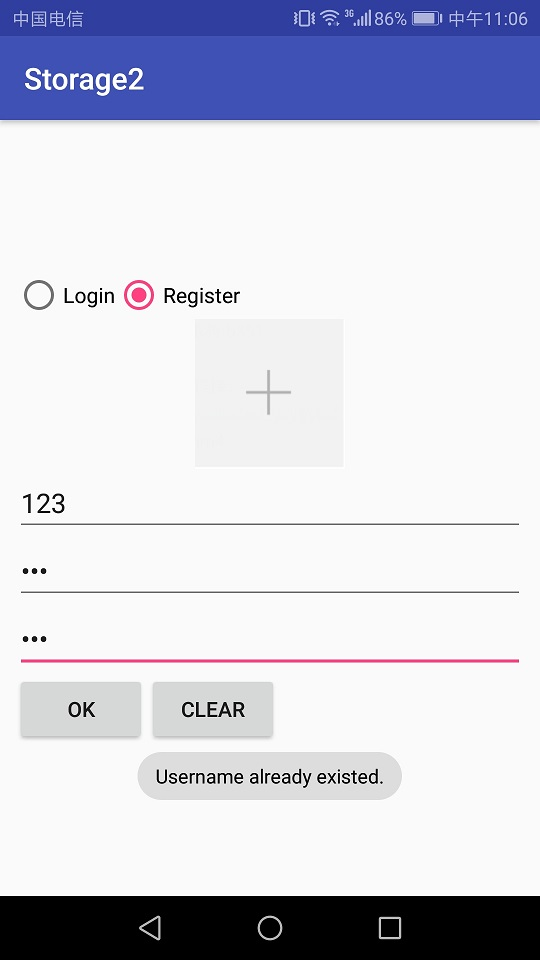
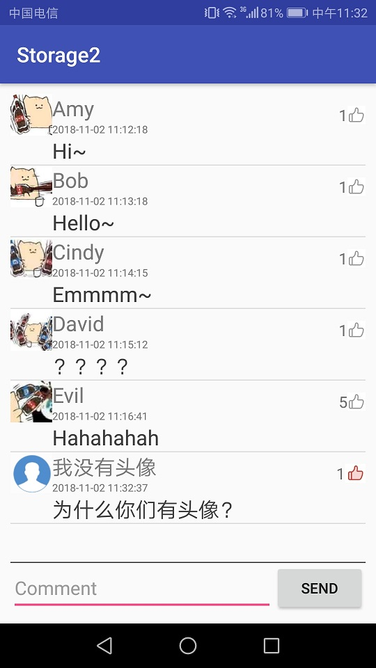

# 中山大学数据科学与计算机学院本科生实验报告

## （2018年秋季学期）

| 课程名称 | 手机平台应用开发 | 任课老师 | 郑贵锋 |
| :------------: | :-------------: | :------------: | :-------------: |
| 年级 | 2016级 | 专业（方向） | 软件工程（计算机应用软件） |
| 学号 | 16340296 | 姓名 | 张子权 |
| 电话 | 13415401985 | Email | ziquanzhang@126.com |
| 开始日期 | 2018/11/10 | 完成日期 | 2018/11/17 |

---

## 一、实验题目

### 数据存储（一） 和 数据存储（二）

### 实验目的

**第十周**

1. 学习SharedPreference的基本使用。
2. 学习Android中常见的文件操作方法。
3. 复习Android界面编程。

**第十一周**

1. 学习SQLite数据库的使用。
2. 学习ContentProvider的使用。
3. 复习Android界面编程。

---

## 二、实现内容

**第十周**

在第六周任务的基础上，实现静态广播、动态广播两种改变Notification 内容的方法。  

**要求**  

* Figure 1：首次进入，呈现创建密码界面。  
 
* Figure 2：若密码不匹配，弹出Toast提示。  
  
* Figure 3：若密码为空，弹出Toast提示。  
  
* Figure 4：退出后第二次进入呈现输入密码界面。  
  
* Figure 5：若密码不正确，弹出Toast提示。  
 
* Figure 6：文件加载失败，弹出Toast提示。  
  
* Figure 7：成功保存文件，弹出Toast提示。  
  
* Figure 8：成功导入文件，弹出Toast提示。  
  

**第十一周**

实现一个评论应用，本次实验虽然号称是（二），但是和（一）无法合并到同一个项目当中，因此本实验应当新建一个项目，而不是在（一）的基础上继续开发。

**要求**

<table>
    <tr>
        <td >点击Login切换到登录界面</td>
        <td >图1.2 若Username为空，则发出Toast提示</td>
    </tr>
    <tr>
        <td>图1.3 若Password为空，则发出Toast提示</td>
        <td >图1.4 若Username不存在，则发出Toast提示 </td>
    </tr>
    <tr>
        <td> 图1.5 若密码不正确，则发出Toast提示</td>
        <td></td>
    </tr>
    <tr>
        <td>图2.1 点击Register切换到注册页面</td>
        <td >图2.2 若Username为空，则发出Toast提示 </td>
    </tr>
    <tr>
        <td>图2.3 若New Password为空，则发出Toast提示</td>
        <td >图2.4 若New Password与Confirm Password不匹配，则发出Toast提示 </td>
    </tr>
    <tr>
        <td>图2.5 若Username已经存在，则发出Toast提示</td>
        <td > </td>
    </tr>  
    <tr>
        <td>图3.1 评论页面</td>
        <td >图3.2 若EditText为空，则发出Toast提示 </td>
    </tr>  
    <tr>
        <td>图3.3 短按评论：弹出对话框，显示该评论的用户以及通讯录中该用户的电话号码</td>
        <td >图3.4 短按评论：弹出对话框，显示该评论的用户以及通讯录中该用户的电话号码 </td>
    </tr>  
    <tr>
        <td>图3.5 弹出是否删除的对话框</td>
        <td >图3.6 弹出是否举报的对话框 </td>
    </tr>  
    <tr>
        <td>图4.1 进入手机图库进行图片选择</td>
        <td >图4.2 ImageView显示本次选择的图片 </td>
    </tr>  
    <tr>
        <td>图4.3 在评论页面，每条Item应当正确显示用户的头像</td>
        <td > </td>
    </tr>  
</table>

---

## 三、课堂实验结果

### (1)实验截图

**第十周**

1. 首次进入，显示创建页码界面。
    
2. 空密码提醒（创建失败）。  
    
3. 密码上下不匹配（创建失败）。  
    
4. 创建密码成功（创建成功）。  
    
5. 清空密码
    
6. 第二次进入界面，登陆失败
    
7. 登陆成功后跳转，输入字符串并保存文件。（保存成功）  
    
8. 清空输入框内的内容。  
    
9. 加载保存的文件。（加载成功）  
    

**第十一周**


1. 进入，注册用户，显示创建用户界面，可以选择图片。
    
2. 用户名已被占用
    
3. 用户登陆界面。  
    
4. 登陆用户名不存在
    
5. 发送信息成功界面。  
    
6. 用户Bob发送信息并给自己点赞。  
    
7. 其余用户发送信息。
    
8. 长按删除自己的信息提醒。
    
9. 长按举报别人的信息。  
    
10. 点击查询相应用户的电话号码，有电话号码  
    
11. 点击查询电话号码，为空。  
    
12. 点赞。
    
13. 点赞用户显示的颜色不一样。只有自己点的赞显示红色  
    


### (2)实验步骤以及关键代码

**第十周**

* 实验步骤
    1. 设计界面，使用线性布局，排好部件的各个位置，调节所占比重。
    2. 进行逻辑设计，对密码进行判断。若密码符合规定格式，则保存在SharedPreferencesz中，使用键值对的方式存储。
    3. 调整界面，设定在存储密码后，隐藏第一个密码框，设置成为登陆界面，修改按钮的点击事件。判断输入密码是否正确，若正确则进行跳转到文件编辑区。
    4. 进入文件编辑区，输入字符串，设计按钮的点击事件，将编辑区中的字符串使用内部存储写入到文件中，文件不存在则新建，load则读入所保存的文件。
    5. 为做到返回直接退出应用，则设置输入密码界面为nohistory，将其从activity中除去。

* 关键代码
    1. 注册成功，存储密码
        ```java
        SharedPreferences sharedPref = getSharedPreferences("USER", Context.MODE_PRIVATE);
        SharedPreferences.Editor editor = sharedPref.edit();
        editor.putString("PASSWORD", fpassword.getText().toString());
        editor.commit();
        Toast.makeText(getApplicationContext(),"Register Successfully",Toast.LENGTH_SHORT).show();
        ```
    2. 获取密码并进行比对，若正确则跳转
        ```java
        SharedPreferences sharedPref = getSharedPreferences("USER", Context.MODE_PRIVATE);

        String password = sharedPref.getString("PASSWORD","");
        if(!password.equals(spassword.getText().toString())){
            Toast.makeText(getApplicationContext(),"Invalid Password",Toast.LENGTH_SHORT).show();
        }else{
            Intent intent = new Intent();
            intent.setClass(MainActivity.this,file_edit.class);
            startActivity(intent);
        }
        ```
    3. 文件读
        ```java
        try (FileInputStream fileInputStream = openFileInput(FILE_NAME)) {
            byte[] contents = new byte[fileInputStream.available()];
            fileInputStream.read(contents);
            text.setText(new String(contents));
            Toast.makeText(getApplicationContext(),"Load Successfully.",Toast.LENGTH_SHORT).show();
        } catch (IOException ex) {
            Toast.makeText(getApplicationContext(),"Load Fail.",Toast.LENGTH_SHORT).show();
            Log.e("TAG", "Fail to read file.");
        }
        ```
    4. 文件写
        ```java
        try (FileOutputStream fileOutputStream = openFileOutput(FILE_NAME, MODE_PRIVATE)) {
            fileOutputStream.write(text.getText().toString().getBytes());
            Toast.makeText(getApplicationContext(),"Save Successfully.",Toast.LENGTH_SHORT).show();
            Log.i("TAG", "Successfully saved file.");
        } catch (IOException ex) {
            Toast.makeText(getApplicationContext(),"Save Fail.",Toast.LENGTH_SHORT).show();
            Log.e("TAG", "Fail to save file.");
        }
        ```

**第十一周**

* 实验步骤
    1. 设计界面，建立登陆和注册界面，通过按钮进行切换。使用隐藏控件的方法实现了。
    2. 设计评论界面，和上几周的类似，使用listview展示评论，并设置各种点击、长按事件。
    3. 定义用户类和评论类，用于保存用户以及评论的各种属性，且便于整合，定义方法，事件。
    4. 建立数据库，建立用户表和评论表分别保存，以id作为主键，从而保存数据。
    5. 保存评论表中的点赞数和点赞用户，从而判断用户是否重复点赞。便于点赞的逻辑实现以及显示。
    6. 给用户添加头像，从相册中选择图片，并进行压缩处理，然后转为二进制文件存储到用户表中。

* 关键代码
    1. 注册逻辑判断（登陆类似）
        ```java
            if(username.getText().toString().equals("")){
                Toast.makeText(getApplicationContext(), "Username cannot be empty.", Toast.LENGTH_SHORT).show();
            }
            else if(spassword.getText().toString().equals("")){
                Toast.makeText(getApplicationContext(), "Password cannot be empty.", Toast.LENGTH_SHORT).show();
            }
            else if(!fpassword.getText().toString().equals(spassword.getText().toString())){
                Toast.makeText(getApplicationContext(), "Password Mismatch.", Toast.LENGTH_SHORT).show();
            }
            else{
                registerUser(username.getText().toString(),spassword.getText().toString());
            }
        ```
    2. 注册成功插入到数据库中
        ```java
        User user = userdb.selectUser(name);
        if(user != null) {
            Toast.makeText(getApplicationContext(), "Username already existed.", Toast.LENGTH_SHORT).show();
        }else {
            userdb.insertUser(name,password,img2byte());
            Toast.makeText(getApplicationContext(), "Register successfully.", Toast.LENGTH_SHORT).show();
        }
        ```
    3. 跳转到评论界面时，传递当前用户id和用户名
        ```java
        Intent intent = new Intent(MainActivity.this,comment_activity.class);
        id = user.get_id();
        String username = user.getUsername();
        intent.putExtra("userid",id);
        intent.putExtra("username",username);
        setResult(2,intent);
        startActivityForResult(intent,1);
        ```
    4. 通过用户名获取头像
        ```java
        public Drawable getAvatar(String username)
        {
            User user = myDB.selectUser(username);
            if(user == null) {
                return null;
            }else{
                Bitmap bmpout = BitmapFactory.decodeByteArray(user.getAvatar(), 0, user.getAvatar().length);
                BitmapDrawable bd= new BitmapDrawable(getResources(), bmpout);
                return bd;
            }
        }
        ```
    5. 返回最新插入的评论id，用于构建评论保持唯一性
        ```java
        Cursor cursor = db.rawQuery("select last_insert_rowid() from comment_table",null);
        if(cursor.getCount()!=0)
        {
            cursor.moveToFirst();
            int id = cursor.getInt(0);
            db.close();
            return id;
        }
        ```
    6. 数据库表的各种列
        ```java
        String CREATE_TABLE = "CREATE TABLE if not exists "
                + TABLE_NAME
                + " (_id INTEGER PRIMARY KEY, name TEXT, password TEXT, avatar BLOB ) ";
        sqLiteDatabase.execSQL(CREATE_TABLE);
        CREATE_TABLE ="CREATE TABLE if not exists "
                + TABLE_NAME2
                +" (_id INTEGER PRIMARY KEY, uname TEXT, content TEXT, time TEXT, likes INTEGER, likelist TEXT ) ";
        ```
    7. 获取头像图片
        ```java
        Intent intent = new Intent();
        intent.setAction(Intent.ACTION_PICK);
        intent.setType("image/*");
        startActivityForResult(intent, 0);
        ```
    8. 存储头像
        ```java
        ContentResolver cr = this.getContentResolver();
        Drawable medrawable = getResources().getDrawable(R.drawable.me);
        Drawable avatar = useravatar.getDrawable();
        if(!isAvatar)
        {
            avatar = medrawable;
        }
        ByteArrayOutputStream baos = new ByteArrayOutputStream();
        Bitmap bitmap = ((BitmapDrawable)avatar).getBitmap();
        bitmap.compress(Bitmap.CompressFormat.PNG, 100, baos);
        return baos.toByteArray();
        ```
    9. 设置点赞逻辑，当进行点赞时，判断此时用户是否在点赞列表之中，若在，则点赞数-1，图标变为白色，若不在，则点赞数+1，图标变为红色。
        ```java
        myListViewAdapter.setOnItemLikeClickListener(new MyListViewAdapter.onItemLikeListener() {
            @Override
            public boolean onLikeClick(int i) {
                boolean islike = commentList.get(i).likeordislike(id);
                myListViewAdapter.refresh(commentList);
                myDB.updateComment(commentList.get(i).get_id(),commentList.get(i).getLike_num(),list2String(commentList.get(i).getUserlike()));
                return islike;
            }
        });
        ```
    10. 数据库的增删改查。
        ```java
        public int insertComment(String username, String time, String content, int likes, String likelist){
            SQLiteDatabase db = getWritableDatabase();
            ContentValues cv = new ContentValues();
            cv.put(COMMENT_USERNAME, username);
            cv.put(COMMENT_TIME, time);
            cv.put(COMMENT_CONTENT, content);
            cv.put(COMMENT_LIKES,likes);
            cv.put(COMMENT_LIKELIST,likelist);
            db.insert(TABLE_NAME2, null, cv);
            Cursor cursor = db.rawQuery("select last_insert_rowid() from comment_table",null);
            if(cursor.getCount()!=0)
            {
                cursor.moveToFirst();
                int id = cursor.getInt(0);
                db.close();
                return id;
            }
            return -1;
        }

        public void deleteComment(Integer id){
            SQLiteDatabase db = getWritableDatabase();
            String where = COMMENT_ID + " = ?";
            String[] whereValue ={ Integer.toString(id) };
            db.delete(TABLE_NAME2, where, whereValue);
            db.close();
        }

        public void updateComment(Integer id, Integer likenum, String userlike){
            SQLiteDatabase db = getWritableDatabase();
            String where = COMMENT_ID + " = ?";
            ContentValues cv = new ContentValues();
            cv.put(COMMENT_LIKELIST,userlike);
            cv.put(COMMENT_LIKES,likenum);
            String[] whereValue ={ Integer.toString(id) };
            db.update(TABLE_NAME2,cv,where, whereValue);
            db.close();
        }

        public Cursor selectAllComment() {
            SQLiteDatabase db = this.getReadableDatabase();
            Cursor cursor = db.rawQuery("select * from comment_table",null);
            return cursor;
        }
        ```

### (3)实验遇到的困难以及解决思路

**第十周**

* #### 遇到的困难
    1. 似乎没有遇到困难
* #### 解决思路
    1. 上网查询类似的方法还有案例。

**第十一周**

* #### 遇到的困难以及解决思路
    1. 如何使用户以及评论保持唯一性。
    解决：用户因为用户名是唯一的，所以可以通过查询该用户名是否被占用，从而保持用户的唯一，而评论则要通过id来进行保持唯一，在这里我通过插入数据库后，返回的id来作为评论的id，因为在数据库之中，主键肯定是唯一的，所以数据库自增是没什么可能会出错的，因此这样能够让界面显示的list和数据库之中的保持一致，也不用为删除评论后，下一个评论的id如何变化而烦恼。
    2. 进行图片选择时会退到桌面。
    解决：发现原来是上一个项目做完后设置了noHistory，而插入图片是使用startactivityforresult来跳转，然后返回图片，所以就退回了桌面。
    3. 图片过大会导致程序崩溃
    解决：按照CSDN的博客先对图片的尺寸进行缩放，然后导出bitmap，存到数据库中，这样图片就不会太大。类似的方法还有使用系统自带的缩略图。不过这样的方法就要先找到存放的路径才可以。

* #### 加分项实现方法
    1. 头像实现：选取图片，并显示到ImageView中，存储时将bitmap转成byte文件，然后存储到数据库之中，当需要显示时，从数据库中读出，再转回bitmap。
        ```java
        public byte[] img2byte()
        {
            ContentResolver cr = this.getContentResolver();
            Drawable medrawable = getResources().getDrawable(R.drawable.me);
            Drawable avatar = useravatar.getDrawable();
            if(!isAvatar)
            {
                avatar = medrawable;
            }
            ByteArrayOutputStream baos = new ByteArrayOutputStream();
            Bitmap bitmap = ((BitmapDrawable)avatar).getBitmap();
            bitmap.compress(Bitmap.CompressFormat.PNG, 100, baos);
            return baos.toByteArray();
        }

        Bitmap bmpout = BitmapFactory.decodeByteArray(user.getAvatar(), 0, user.getAvatar().length);
        BitmapDrawable bd= new BitmapDrawable(getResources(), bmpout);
        return bd;
        ```
    2. 点赞记录实现，在每一条评论中设置一个list列表，存储点赞的id，保证用户都是唯一的，然后当用户进行点赞时，先判断是否在列表中，若在，则已经进行点赞过，那么该操作为取消点赞，反之则是进行点赞。显示评论时读入当前用户的id，若在这个列表中，则图标变红，若不在图标则为白色。实现点赞状态。点击事件则是通过在适配器中添加一个接口，让点击列表项时，传递一个位置给这个函数，实现点击目标的获取，然后对这个目标进行操作。
    保存点赞列表到数据库我是采用了将list转变为String，用“，”，进行隔开，这样能够区分各个项，同时也能保存为String类型，读出来时则用分割函数再切割回String数组存回列表之中。
        ```java
        viewHolder.like.setOnClickListener(new View.OnClickListener() {
            @Override
            public void onClick(View v) {
                if(mOnItemLikeListener.onLikeClick(i)){
                    viewHolder.like.setImageResource(R.drawable.red);
                    Toast.makeText(context,"你的点赞使漩涡扩大",Toast.LENGTH_SHORT);
                }else{
                    viewHolder.like.setImageResource(R.drawable.white);
                }
            }
        });


        myListViewAdapter.setOnItemLikeClickListener(new MyListViewAdapter.onItemLikeListener() {
            @Override
            public boolean onLikeClick(int i) {
                boolean islike = commentList.get(i).likeordislike(id);
                myListViewAdapter.refresh(commentList);
                myDB.updateComment(commentList.get(i).get_id(),commentList.get(i).getLike_num(),list2String(commentList.get(i).getUserlike()));
                return islike;
            }
        });
        ```

---

## 四、实验思考及感想

* **实验思考**
    在本次的实验实验中，初步学习了应用的存储，以及文件的读写。学习了安卓应用有两种存储，分别是内部和外部存储，内部存储即存储在应用的内部，其它外部的应用以及用户都不能访问。而外部存储则是最常见的读入外部的文件，通过调用java的文件API来读写，这样其它应用和用户都可以进行访问。
    还了解到了安卓另一种轻量级的存储,通常用于保存应用状态，常用配置等等。

    第十一周的实验则让我学会如何在Android中使用数据库，和一般的数据库相类似，它有两种执行语句，一种是直接实行SQL语言，一种则是弄成函数，将其中的关键要素分开变为参数输入，从而实现SQL的操作。学会了数据库就能做到数据的持久性，保存信息则更为安全，还能进行加密处理。对图片的存储让图片能够持久存在应用之中，而不必再通过路径来进行获取。而点赞的处理则让我学会如何将一个不能存储的类型存储到数据库中。

* **实验感想**
    在项目三中都是围绕着数据存储来做的，可见数据存储是十分重要的，只有能够保存数据，才能让这个应用能够多次正常运行，并且保持上一次的状态。数据库关乎各种信息，良好的设计能够让数据安全的保存，同时也不能过多冗余使得存储空间大幅减少。
    这次实验感觉能够做成一个论坛了，虽然和一般的论坛还有较大的差距，但我觉得已经初见雏形了，至少和台湾那个PTT差不大，加上一个回复功能大概就是了。而且这次的数据库运用对期中项目的帮助很大，可以有效的构建起一个完整的数据库便于查询英雄实现，而且还学会了应该要先构建要存储的类然后再在数据库中导出，而不是返回一个cursor，不然就有资源泄漏的风险。