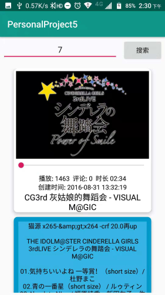

# 中山大学数据科学与计算机学院本科生实验报告

## （2018年秋季学期）

| 课程名称 | 手机平台应用开发 | 任课老师 | 郑贵锋 |
| :------------: | :-------------: | :------------: | :-------------: |
| 年级 | 2016级 | 专业（方向） | 软件工程（计算机应用软件） |
| 学号 | 16340296 | 姓名 | 张子权 |
| 电话 | 13415401985 | Email | ziquanzhang@126.com |
| 开始日期 | 2018/12/11 | 完成日期 | 2018/12/12 |

---

## 一、实验题目

### WEB API

### 实验目的

第十四周任务

1. 学会使用HttpURLConnection请求访问Web服务
2. 学习Android线程机制，学会线程更新UI
3. 学会解析JSON数据
4. 学习CardView布局技术

第十五周任务

1. 理解Restful接口
2. 学会使用Retrofit2
3. 复习使用RxJava
4. 学会使用OkHttp

---

## 二、实现内容

### 第十四周

实现一个bilibili的用户视频信息获取软件
<table>
    <tr>
        <td >打开程序主页面</td>
        <td >输入用户id，要求正整数int类型，不满足的弹Toast提示即可</td>
    </tr>
    <tr>
        <td >输入用户id，点击搜索，网络没打开则弹Toast提示网络连接失败</td>
        <td >网络打开情况下，输入用户id，不存在相应数据的弹Toast提示</td>
    </tr>
    <tr>
        <td >输入用户id = 2，点击搜索，展示图片/播放数/评论/时长/创建时间/标题/简介内容</td>
        <td >再次输入用户id = 7，接着上次结果继续展示以上内容</td>
    </tr>
</table>

* 搜索框只允许正整数int类型，不符合的需要弹Toast提示
* 当手机处于飞行模式或关闭wifi和移动数据的网络连接时，需要弹Toast提示
* 由于bilibili的API返回状态有很多，这次我们特别的限制在以下几点
    * 基础信息API接口为： `https://space.bilibili.com/ajax/top/showTop?mid=<user_id>`
    * 图片信息API接口为基础信息API返回的URL，cover字段
    * 只针对前40的用户id进行处理，即`user_id <= 40`
    * [2,7,10,19,20,24,32]都存在数据，需要正确显示
* **在图片加载出来前需要有一个加载条，不要求与加载进度同步**
* 布局和样式没有强制要求，只需要展示图片/播放数/评论/时长/创建时间/标题/简介的内容即可，可以自由发挥
* **布局需要使用到CardView和RecyclerView**
* 每个item最少使用2个CardView，布局怎样好看可以自由发挥，不发挥也行
* 不完成加分项的同学可以不显示SeekBar
* 输入框以及按钮需要一直处于顶部

加分项
<table>
    <tr>
        <td >拖动SeekBar，显示相应位置的预览图</td>
        <td >拖动SeekBar，显示相应位置的预览图</td>
    </tr>
</table>

* 拖动前后均显示原图片
* 模拟bilibili网页PC端，完成可拖动的预览功能
* 拖动seekBar，预览图会相应改变
* 前40的用户id中，32不存在预览图，可以忽略也可以跟demo一样将seekbar的enable设置为false
* 需要额外使用两个API接口，分别为
    * 利用之前API获得的信息，得到aid传入`https://api.bilibili.com/pvideo?aid=<aid>`
    * 利用`api.bilibili.com`得到的信息，解析image字段得到`"http://i3.hdslb.com/bfs/videoshot/3668745.jpg` 的图片
    * 分割该图片即可完成预览功能
* 加分项存在一定难度，需要不少额外编码，**可不做**。
* 32不存在预览图，可忽略或处理该异常情况

### 第十五周

#### 实现一个github用户repos以及issues应用
<table>
    <tr>
        <td >主界面有两个跳转按钮分别对应两次作业</td>
        <td >github界面，输入用户名搜索该用户所有可提交issue的repo，每个item可点击</td>
    </tr>
    <tr>
        <td >repo详情界面，显示该repo所有的issues</td>
        <td >加分项：在该用户的该repo下增加一条issue，输入title和body即可</td>
    </tr>
</table>

* 教程位于`./manual/tutorial_retrofit.md`
* 每次点击搜索按钮都会清空上次搜索结果再进行新一轮的搜索
* 获取repos时需要处理以下异常：HTTP 404 以及 用户没有任何repo
* 只显示 has_issues = true 的repo（即fork的他人的项目不会显示）
* repo显示的样式自由发挥，显示的内容可以自由增加（不能减少）
* repo的item可以点击跳转至下一界面
* 该repo不存在任何issue时需要弹Toast提示
* 不完成加分项的同学只需要显示所有issues即可，样式自由发挥，内容可以增加

### 加分项
* 加分项旨在学习Retrofit2的POST请求，加深Rest API的理解
* demo需要你们额外提供TOKEN参数，这点不必实现，实现了反而不利于检查
* 提交的代码可以删除掉你的token等授权信息
* 仅处理提交成功与提交失败两种状态
* issue提交成功后需要刷新展示出来

* **加分项注意事项**
* **不要在他人repo下随意提交issue测试，自己新建一个repo即可**
* **管理好自己的github授权（token，client id等），验收结束后请删除对应授权**

---

## 三、课堂实验结果

### (1)实验截图

#### 第十四周

1. 打开应用，首页为一个输入框加一个搜索按钮，可输入用户id以此来查看其代表作（置顶作品），若输入的不是数字，则会弹出消息。  
     
2. 输入id = 2，即可查看id为2的用户的置顶作品。同理，输入id = 7，id = 32，也可以查看到其它作品。  
       
3. 当没有网络连接时，弹出提示消息“无网络连接”，当查询不到目标用户的置顶作品时，提示“数据库中不存在记录”。  
     
4. 添加预览图，移动seekbar可以更换预览图到相关的视频位置。  
         
5. 当视频还在加载时，显示进度条，加载完后消失。当视频不存在预览图时，锁定seekbar。  
     

#### 第十五周

1. 打开应用，显示一个输入框，用于输入github用户名。
   

2. 根据用户名查询其github仓库，仅显示不是fork的仓库。
   

3. 点击某一个仓库可以查看该仓库的所有Issue
   

4. 输入token，title，body可以为该仓库添加Issue
   

5. 添加Issue完毕
   


### (2)实验步骤以及关键代码

#### 第十四周

* 实验步骤
    1. 设计应用界面，调整recycleView适配器，设置item界面等等。例如cardView的阴影圆角，进度条等等。  
    **关键代码：**
        

    2. 使用HttpUrlConnection来调用api，获得目标id用户的代表作，添加到显示列表之中。其中使用GSON来直接解析JSON得到对应的对象。若出现异常，则根据异常抛出对应的错误，值得注意的是在子线程使用Toast传递消息要写Looper.prepare()创建消息循环，Looper.loop()启动消息循环队列，这样才能使用Toast。  
    **关键代码：**
        ```java
        rx.Observable observable = Observable.create(new Observable.OnSubscribe() {
            @Override
            public void call(Object o) {
                Subscriber subscriber = (Subscriber) o;
                String id = ed_id.getText().toString();
                try {
                    URL url = new URL("https://space.bilibili.com/ajax/top/showTop?mid="+id);
                    HttpURLConnection httpURLConnection = (HttpURLConnection) url.openConnection();
                    httpURLConnection.setRequestMethod("GET");
                    Log.i("HTTP", "respCode = " +
                            httpURLConnection.getResponseCode());
                    Log.i("HTTP", "contentType = " +
                            httpURLConnection.getContentType());
                    Log.i("HTTP", "content = " + httpURLConnection.getContent());
                    InputStream inputStream = httpURLConnection.getInputStream();//获得输入流
                    Video obj = new Gson().fromJson(inputstream2String(inputStream), Video.class);
                    subscriber.onNext(obj);
                    subscriber.onCompleted();
                } catch (MalformedURLException e) {
                    e.printStackTrace();
                } catch (IOException e) {
                    Looper.prepare();
                    Toast.makeText(getApplicationContext(),"网络连接失败", Toast.LENGTH_SHORT).show();
                    Looper.loop();
                    e.printStackTrace();
                } catch (Exception e){
                    Looper.prepare();
                    Toast.makeText(getApplicationContext(),"数据库中不存在记录", Toast.LENGTH_SHORT).show();
                    Looper.loop();
                    e.printStackTrace();
                }
            }
        }).subscribeOn(Schedulers.io()).observeOn(AndroidSchedulers.mainThread());
        ···
        public void onNext(Object o) {
            Video obj = (Video)o;
            if(obj.getStatus()){
                videoList.add(obj.getData());
                myAdapter.notifyDataSetChanged();
            }
        }
        ```

    3. 在添加到列表之后，绑定video的信息到控件上，从而显示作品信息。因为现在得到的还是封面的链接，所以还要一个网络请求来获得图片，所以在covert中再写一个异步操作得到封面图，然后传递给imageView。
    **关键代码：**
        ```java
        //通过url取得图片
        if(s.getCoverimage()==null) {
            rx.Observable observable = Observable.create(new Observable.OnSubscribe() {
                @Override
                public void call(Object o) {
                    pb_img.setVisibility(View.VISIBLE);
                    Subscriber subscriber = (Subscriber) o;
                    Object[] output = new Object[3];
                    try {
                        URL cover = new URL(s.getCover());
                        HttpURLConnection httpURLConnection = (HttpURLConnection) cover.openConnection();
                        httpURLConnection.setRequestMethod("GET");
                        if (httpURLConnection.getResponseCode() == 200) {
                            InputStream inputStream = httpURLConnection.getInputStream();
                            Bitmap bitmap = BitmapFactory.decodeStream(inputStream);
                            output[0] = bitmap;
                        }
                        httpURLConnection.disconnect();
        ```
以上为基础部分实现，接下来的是加分项预览图实现

* #### 加分项实现方法
    ##### 总体思路：
    * 先使用api网络请求得到图片信息后，在绑定图片时，除了得到图片封面，再根据视频av号通过第二个api得到预览信息，注意现在的预览图也只是一个链接，接着还是需要再根据这个链接得到一张雪碧图。
    * 除了得到雪碧图，还需要得到一个数组index，该数组记录每一个片段对应的视频时间，最后给滑动条添加事件监听器，根据滑动位置判断时间，切割雪碧图得到相应的图片再显示出来。

    ##### 具体步骤：
    1. 请求图片后，接着使用第二个api。因为考虑到返回的数据需要的并不多，因此不再使用GSON的方法，而是使用自带的JSON类进行解析，单独取出image和index。
    **关键代码：**
        ```java
        URL url = new URL("https://api.bilibili.com/pvideo?aid=" + s.getAid());
        HttpURLConnection conn = (HttpURLConnection) url.openConnection();
        conn.setRequestMethod("GET");
        InputStream is = conn.getInputStream();//获得输入流
        String json = inputstream2String(is);

        JSONArray spriteurl = null;
        JSONArray index = null;
        try {
            JSONObject jsonObject = new JSONObject(json);
            JSONObject data = (JSONObject) jsonObject.get("data");
            index = data.getJSONArray("index");
            spriteurl = data.getJSONArray("image");
        } catch (JSONException e) {
            e.printStackTrace();
        }
        ```
    2. 使用完第二个api之后，就再次请求获得雪碧图，生成bitmap填到列表的类中。考虑到有些视频的预览图过多，多张雪碧图，于是采用一个数组存储。为了方便起见，传出一个Object数组，分别存储（1）封面（2）雪碧图数组（3）视频时间数组。一次性传出到next中。
    **关键代码：**
        ```java
        Object[] output = new Object[3];
        ···
        Bitmap bitmap = BitmapFactory.decodeStream(inputStream);
        output[0] = bitmap;
        ···
        Bitmap[] sprites = new Bitmap[spriteurl.length()];
        ···
        output[1] = sprites;
        output[2] = index;
        subscriber.onNext(output);
        ```
    3. 在子线程传出object数组后，根据对应类型转化成相应的类型，赋值给列表中原本的元素（video）。
    **关键代码：**
        ```java
        Object[] out = (Object[]) o;
        Bitmap cover = (Bitmap) out[0];//封面
        iv_cover.setImageBitmap(cover);
        pb_img.setVisibility(View.INVISIBLE);

        s.setCoverimage(cover);
        s.setSpiritimage((Bitmap[]) out[1]);//预览雪碧图
        JSONArray ja = (JSONArray) out[2];  //视频时间表
        Integer[] index = new Integer[ja.length()];
        for (int i = 0; i < ja.length(); i++) {
            index[i] = ja.optInt(i);
        }
        s.setIndex(index);
        sb_sprite.setMax(index[ja.length() - 1]);
        ```
    4. 给滑动条添加监听器，先根据滑动条的位置，得到要显示的视频时间，再根据视频时间找到对应的图片位置。之后就是单独切割该预览图出来，替换到封面上，然后最后就是当拉回初始界面时，重新显示封面。
    **关键代码：**
        ```java
        sb_sprite.setOnSeekBarChangeListener(new SeekBar.OnSeekBarChangeListener() {
            @Override
            public void onProgressChanged(SeekBar seekBar, int progress, boolean fromUser) {
                if(fromUser){
                    Integer num =0;
                    Integer spritenum = 0;
                    Integer [] index = s.getIndex();
                    Bitmap[] sprites = s.getSpiritimage();
                    for (int i = 0; i<index.length;i++){
                        if (index[i]>=progress){
                            num = i;
                            break;
                        }
                    }
                    spritenum = num/99;
                    num = num % 100;
                    Bitmap sprite = Bitmap.createBitmap(sprites[spritenum],(num%10)*160 ,(num/10)*90 , 160,90);
                    iv_cover.setImageBitmap(sprite);

                    if(progress == 0){
                        iv_cover.setImageBitmap(s.getCoverimage());
                    }
                }
            }
        ```

#### 第十五周

* 实验步骤
    1. 还是先设计好显示的页面，布置格局，进行排版调整，划分Activity。
    **关键代码：**
        

        

    2. 本次实验使用retrofit来进行网络请求，retrofit是restful的HTTP网络请求库，仅仅负责网络请求接口的封装，最后还是需要交给Okhttp完成请求，返回的结果也是由Okhttp交给Retrofit解析。
    **关键代码：**
        ```java
        public interface GitHubService {
            @GET("/users/{user_name}/repos")
                // 这里的List<Repo>即为最终返回的类型，需要保持一致才可解析
                // 之所以使用一个List包裹是因为该接口返回的最外层是一个数组
            Observable<List<Repo>> getRepo(@Path("user_name") String user_name);

            @GET("/repos/{user_name}/{repo_name}/issues")
            Observable<List<Issue>> getIssue(@Path("user_name") String user_name, @Path("repo_name") String repo_name);
        ```

    3. 实例出网络请求接口，然后用Retrofit进行封装，这里因为要配合Rxjava来进行异步请求，所以类型为Observable,因为返回的是一个数组，所以用List。Rxjava的操作同上一次实验一样。
    **关键代码：**
        ```java
        //构建Retrofit对象
        Retrofit retrofit = new Retrofit.Builder()
                .baseUrl(baseURL)
                .addConverterFactory(GsonConverterFactory.create())
                .addCallAdapterFactory(RxJavaCallAdapterFactory.create())
                .client(build)
                .build();

        //创建 网络请求接口 的实例
        GitHubService service = retrofit.create(GitHubService.class);

        //对请求进行封装
        Observable<List<Repo>> userCall = service.getRepo(user_name);
        ```
以上为基础部分实现，接下来的是加分项通过POST操作实现新增一个Issue

* #### 加分项实现方法

    ##### 具体步骤：
    1. POST请求和GET类似，但是调用API需要身份认证，因此需要在请求头上加上认证信息，如token、账号密码等等，为了限制权限，最好使用token。
    **关键代码：**
        ```java
        @Headers("Authorization: token OAUTH-TOKEN")
        @POST("/repos/{user_name}/{repo_name}/issues")
        Observable<Issue> postIssue(@Path("user_name") String user_name, @Path("repo_name") String repo_name, @Body RequestBody body);
        ```
    2. POST所需要的是JSON格式数据，所以把数据变成JSON格式的字符串放到请求的body中。
    **关键代码：**
        ```java
        String title = et_title.getText().toString();
        String body = et_body.getText().toString();
        Map<String,String> issue = new HashMap<>();
        issue.put("title", title);
        issue.put("body",body);

        Gson gson=new Gson();
        String strEntity = gson.toJson(issue);
        RequestBody issuebody = RequestBody.create(MediaType.parse("application/json;charset=UTF-8"),strEntity);
        postIssue(user_name,repo_name,issuebody);
        ```
    3. 若请求成功，则返回创建成功的Issue信息，若请求失败，则会出错，返回HTTP 404 not found则是请求信息有误，403 forbidden通常为超过请求次数，频率过高，401 no authentic则是无授权。抛出异常即可。

### (3)实验遇到的困难以及解决思路

#### 第十四周

* #### 遇到的困难以及解决思路

    1. 本次遇到的困难第一个就是解析JSON。
    解决思路：根据TA的教程，使用GSON解析，建立一个和JSON属性一样的类，对应好每一个属性，然后直接得到对应的对象。

    2. 第二个困难得到aid之后，怎么获得预览图链接再获得预览图
    解决思路：根据连续性，最好的就是在一个子线程中解决完所有问题，另开线程没有必要而且容易出错，因此在异步中连续3个网络请求，最后输出的时候一次性传出来更新主线程的UI。

    3. 出现异常容易乱套，例如控件是非线程安全的。
    解决思路：如果有一个预览图是取不出来的，设置enable的时候抛出异常，还不知道控件原来是非线程安全的，就是一个控件只能被创建它的线程所使用，其它线程使用就会出现异常

#### 第十五周

* #### 遇到的困难以及解决思路

    1. 在POST的时候添加头的时候总是出错，使用了postman来测试仍然是http 404 not found。
    解决思路：后来发现好像github的token使用比较特殊，参考了[https://developer.github.com/apps/building-oauth-apps/understanding-scopes-for-oauth-apps/](https://developer.github.com/apps/building-oauth-apps/understanding-scopes-for-oauth-apps/)后发现貌似是github的这个认证比较特殊，是Authorization: token + OAUTH-TOKEN，我是使用了Authorization: + Token,结果每次都出错，但是按照那种格式用了动态header还是不行，也不知道怎么动态绑定，curl倒是可以，最后只能使用Headers静态头了。

    2. 要调用api要提交一个JSON数据
    解决思路：按照给定的API使用方法以及所给的例子，可知创建一个新的Issue要提交一个JSON，所以使用GSON来进行构造，先放进一个map，在转换成json格式的字符串，最后放在Requestbody之中。

---

## 四、实验思考及感想

* **实验思考**

    1. 这次实验的异步调用让我更加了解如何去使用Rxjava，例如object这个东西，感觉父类就是万能样子，能塞各种东西进去，弄一个Object数组就十分方便了，构成一个集合类似的东西一次性传出去分别使用。

    2. 预览图的实验其实还是有着一点的bug，大部分还是可以正常显示的，因为在发现大多数的预览图大小都是160*90的规格，因此就固定了下来，直到某次发现并不是这样的，某些特殊的视频预览图的格式会不一样。所以都是没有拿到所有数据的锅。刚开始为了方便只从JSON中拿了预览图的数据，后来发现有些比较大的视频会有多张雪碧图，又添加了一个数组。到最后某些规格不一样，懒得去动了 ( 反正大部分都符合。。。说明拿到全部参数还是比较好，既然它出现了，就可能存在着某些的意义。

* **实验感想**

    这一次的实验主要是了解安卓的web api如何去调用，主要是3个http访问方式，我们实验中用到了HttpConnection和Okhttp，调用API则要学会解析返回的数据，一般都是JSON或者是XML，在这里似乎JSON居多，在解析JSON的时候，我学会了2种方法，一种是构造对应的类使用GSON来进行获取，一种则是利用JSONObject或JSONArray来逐步get到里面的数据。Rxjava的异步调用似乎可以和很多方法进行配合，而且看起来很舒服，让我在另一个课程中也使用了它来进行异步的操作，不过在处理一些很小的操作的时候，又显得很长，可能适用于一些比较复杂的操作上会好很多。